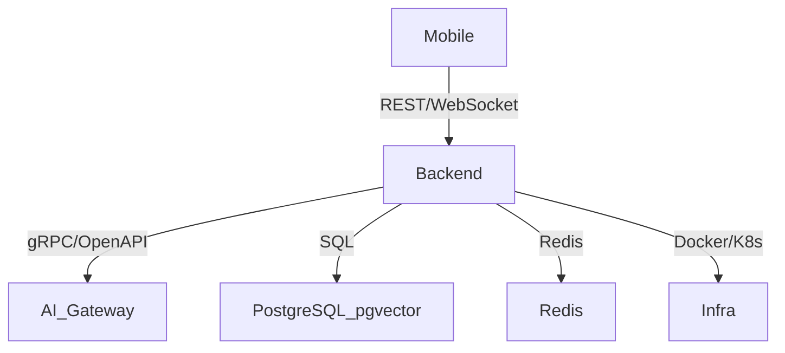

# Архитектура IRL Quest

## Основные компоненты
- Backend (Rust, FastAPI, Celery)
- Mobile (Android, Kotlin)
- AI Gateway: локальные ML-модели и RAG
- Векторная база данных: PostgreSQL + pgvector
- Инфраструктура: Docker, Kubernetes, Terraform
- Кэш и очереди: Redis

## Взаимодействие
Мобильное приложение общается с backend через REST и WebSocket API. Backend управляет бизнес-логикой, хранит данные, интегрируется с локальными ML-модулями и pgvector для поиска и генерации.

## Роль Rust
- Высокопроизводительный сервер задач, квестов, пользователей
- Интеграция с ML и RAG через gRPC/OpenAPI
- Обработка событий, синхронизация, безопасность

## RAG и ML
- Векторный поиск по учебным материалам и задачам
- Генерация контента с опорой на локальные данные

## Масштабирование и отказоустойчивость
- Горизонтальное масштабирование backend через Kubernetes
- Репликация PostgreSQL и pgvector
- Резервное копирование и мониторинг
- Health-checks, автоматический рестарт сервисов

## Диаграмма

_Для подробной схемы используйте mermaid или PNG._
