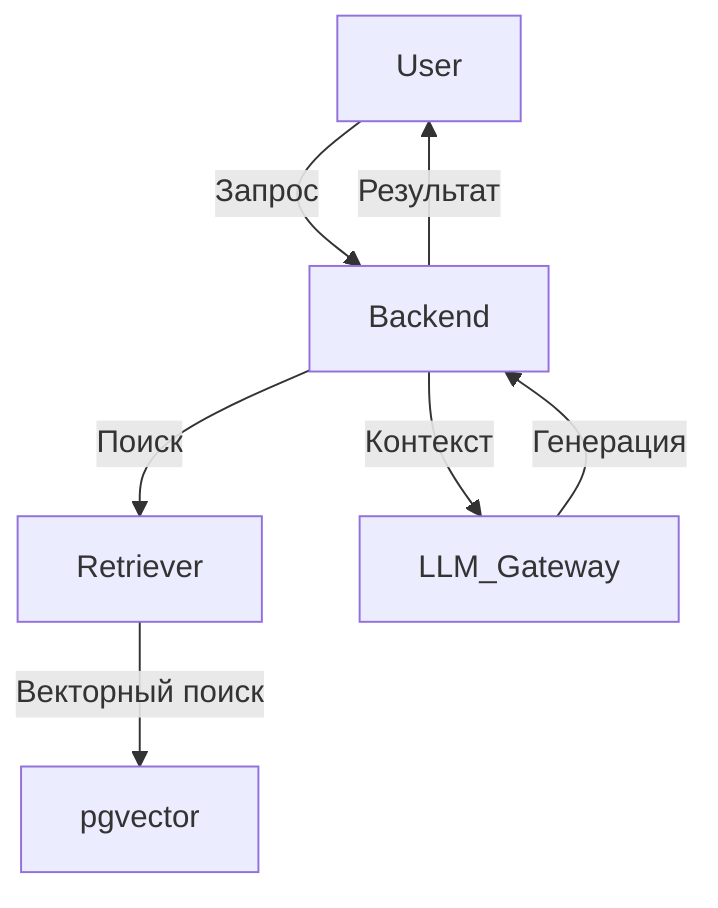

# RAG-дизайн в IRL Quest

## Что такое RAG?
Retrieval-Augmented Generation — генерация с обращением к внешним данным, в нашем случае через локальные ML-модели и векторную pgvector базу.

## В проекте
- Индексация учебных материалов и документов в pgvector
- Векторный поиск по базе (PostgreSQL + pgvector)
- Генерация тестов и заданий с опорой на найденные фрагменты локальной модели

## Архитектура RAG
- Ingestor: загрузка и разбиение документов
- Retriever: поиск релевантных фрагментов в pgvector
- LLM Gateway: локальные модели для генерации с контекстом
- Backend: orchestration, сохранение результатов, логирование

## Схема пайплайна

## Best practices
- Храните только необходимые данные в pgvector
- Используйте batch-индексацию для крупных документов
- Логируйте все обращения к ML и RAG
- Обеспечьте fallback на стандартные ответы при ошибках ML
